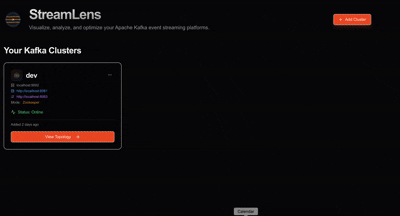

# StreamLens - Apache Kafka Topology View

A full-stack app for visualizing Kafka topologies (topics, producers, consumers, streams, schemas, connectors) with an AI Q&A layer.





## Project structure

- **client/** — React frontend (Vite, TypeScript). Dependencies: `client/package.json`.
- **server/** — Python backend (FastAPI). Dependencies: `server/pyproject.toml`.

## Quick start

**Backend**

```bash
cd server
uv sync 
# First time only: install dependencies
uv pip install -e .

# Start backend server (every time)
uv run uvicorn main:app --reload --port 5000
```

> ⚠️ **Important**: Always use `uv run` to start the backend and run Python scripts. This ensures the correct environment with all dependencies is used.

**Frontend**

```bash
cd client
npm install  # First time only
npm run dev
```

Open the client (e.g. http://localhost:5173). In dev, the client proxies `/api` to the backend (default `http://localhost:5000`). Set `VITE_API_URL` if your API runs elsewhere.

## Security & Permissions

### Kafka ACLs (Required for secured clusters)

If your Kafka cluster has ACLs enabled, you need to grant the StreamLens application READ permissions to access cluster metadata:

```bash
# Grant READ access to topics, consumer groups, and cluster metadata
kafka-acls.sh --bootstrap-server localhost:9092 \
  --add --allow-principal User:'*'  --allow-host streamlenshost\
  --operation Read --topic '*' \
  --operation Describe --topic '*' \
  --operation Describe --cluster \
  --operation Describe --group '*'

# For JMX producer detection (optional), ensure JMX ports are accessible
# No additional Kafka ACLs needed for JMX
```

**Replace `User:streamlens` with your actual principal** (SASL username, mTLS DN, etc.)

### Read-Only Tool

**StreamLens is 100% read-only.** It only performs the following operations:
- ✅ List topics, consumer groups, connectors, schemas
- ✅ Read cluster metadata, consumer lag, topic contents and metrics
- ✅ Query JMX for producer detection (if enabled)

**It NEVER:**
- ❌ Creates, updates, or deletes topics
- ❌ Modifies consumer group offsets
- ❌ Produces or consumes messages
- ❌ Changes any cluster configuration

This makes StreamLens safe to use in production environments for monitoring and visualization.

## Environment

- **server**: Cluster list is stored in a **JSON file** (no database). Default path: `server/data/clusters.json`. Override with `CLUSTERS_JSON` (e.g. `/etc/streamlens/clusters.json`). An admin can edit this file and restart the server to add/remove clusters—no login or DB setup. Topology snapshots are kept in memory (refreshed on Sync or every minute). `TOPOLOGY_MAX_TOPICS` (optional; default `2000`) — cap on topic nodes for very large clusters. Optional for AI chat: **OpenAI** — `AI_INTEGRATIONS_OPENAI_API_KEY`, `AI_INTEGRATIONS_OPENAI_BASE_URL`; **Gemini** — `AI_PROVIDER=gemini`, `AI_INTEGRATIONS_GEMINI_API_KEY` (`uv sync --extra gemini`); **Anthropic** — `AI_PROVIDER=anthropic`, `AI_INTEGRATIONS_ANTHROPIC_API_KEY` (`uv sync --extra anthropic`); **Ollama** (local) — `AI_PROVIDER=ollama`, optional `OLLAMA_BASE_URL`, `OLLAMA_MODEL`. See [docs/AI_SETUP.md](docs/AI_SETUP.md).
- **client**: `VITE_API_URL` (optional, default `http://localhost:5000` for proxy target).

### Cluster configuration (JSON)

Edit `server/data/clusters.json` (or the path set by `CLUSTERS_JSON`) to manage clusters without the UI. Restart the server after changes. Example:

```json
{
  "clusters": [
    {
      "id": 1,
      "name": "Production",
      "bootstrapServers": "localhost:9092",
      "schemaRegistryUrl": "http://localhost:8081",
      "connectUrl": "http://localhost:8083",
      "jmxHost": null,
      "jmxPort": null,
      "createdAt": "2025-01-01T00:00:00Z"
    }
  ]
}
```

Use unique `id` values (integers). You can also add clusters via the UI; they are written to the same file.

**SSL / TLS (e.g. port 9093):** To connect to Kafka over SSL, add optional fields to the cluster object:

- `securityProtocol` — `"SSL"`, `"SASL_SSL"`, `"PLAINTEXT"` (default), or `"SASL_PLAINTEXT"`
- `sslEndpointIdentificationAlgorithm` — Set to `""` (empty string) to disable hostname verification (e.g. for self-signed or dev); omit or use `"https"` for default verification.
- **PEM-style** (librdkafka): `sslCaLocation`, `sslCertificateLocation`, `sslKeyLocation`, `sslKeyPassword` — paths to PEM files.
- **Java-style truststore/keystore** (converted to PEM internally; requires `keytool` and `openssl` on the server host):
  - `sslTruststoreLocation` — Path to JKS truststore (e.g. `client.truststore.jks`)
  - `sslTruststorePassword` — Truststore password
  - `sslKeystoreLocation` — Path to keystore (e.g. `client.keystore.p12`)
  - `sslKeystoreType` — `pkcs12` or `p12`
  - `sslKeystorePassword` — Keystore password
  - `sslKeyPassword` — Key password (if different)
- `enableSslCertificateVerification` — Set to `false` to **disable broker certificate verification** (dev/self-signed only; **insecure**). Use only when the broker uses a self-signed cert and you cannot get verification working with the truststore/PEM CA.

Example for SSL on port 9093 with Java-style truststore/keystore:

```json
{
  "id": 2,
  "name": "prod-ssl",
  "bootstrapServers": "broker1:9093,broker2:9093",
  "securityProtocol": "SSL",
  "sslEndpointIdentificationAlgorithm": "",
  "sslTruststoreLocation": "/path/to/client.truststore.jks",
  "sslTruststorePassword": "your-truststore-password",
  "sslKeystoreLocation": "/path/to/client.keystore.p12",
  "sslKeystoreType": "pkcs12",
  "sslKeystorePassword": "your-keystore-password",
  "sslKeyPassword": "your-key-password"
}
```

Example with PEM only (no client cert):

```json
{
  "bootstrapServers": "broker1:9093",
  "securityProtocol": "SSL",
  "sslCaLocation": "/path/to/ca-cert.pem"
}
```

Leave `securityProtocol` unset (or `PLAINTEXT`) for plaintext port 9092.

**If you still see "certificate verify failed":** Either (1) set `enableSslCertificateVerification` to `false` in the cluster config for **development only** (insecure), or (2) export the CA that signed your broker certificate to a PEM file and set `sslCaLocation` to that path (e.g. `keytool -exportcert -rfc -keystore client.truststore.jks -storepass pass -alias your-ca-alias -file ca.pem`).

## Topology: Auto-Discovery

### Auto-Discovered Entities (Real-Time, No Client Changes)

- **Topics** — Fetched from Kafka broker metadata
- **Consumer Groups** — Auto-discovered via AdminClient (shows which topics each group consumes from)
- **Producers (JMX)** — Optional: If JMX enabled on brokers, shows topics with active producers RIGHT NOW (see [JMX Setup](docs/JMX_SETUP.md))
- **Producers (ACL)** — Optional: If Kafka ACLs are enabled, shows potential producers based on WRITE permissions
- **Connectors** — Fetched from Kafka Connect REST API (if configured)
- **Schemas** — Fetched from Schema Registry REST API (if configured)

## Auto-Discovery

Most entities are automatically discovered in real-time:
- **Topics** — From Kafka broker
- **Consumer Groups** — From Kafka AdminClient
- **Producers** — From JMX metrics or ACLs
- **Connectors** — From Kafka Connect API (optional)
- **Schemas** — From Schema Registry (optional, click schema nodes to view full definitions)


### Visual Indicators

- **🌟 Live** (Green badge) — Consumers auto-discovered from Kafka consumer groups in real-time. **Click consumer nodes** to view lag per partition.
- **⚡ JMX** (Yellow badge) — Active producers detected from JMX metrics (topics receiving messages NOW)
- **📄 Schema Nodes** — Topics with registered schemas show small linked schema nodes. **Click the schema node** to view the full schema definition in a dialog.

**To enable Schema Registry integration**: When adding/editing a cluster, provide the `schemaRegistryUrl` (e.g., `http://localhost:8081`). Schema nodes will appear automatically after refreshing the topology.

Click the **ℹ️ Info** button in the topology view for more details.

### StreamPilot AI Assistant

The topology includes an AI-powered chat assistant (**StreamPilot**) that can answer questions about your Kafka cluster and **automatically highlight & zoom to relevant nodes**.

**Setup Required**: See [`docs/AI_SETUP.md`](docs/AI_SETUP.md) for configuration instructions.

Example questions:
- "Which producers write to testtopic?" → Highlights producers & zooms to them
- "Show me all consumers for orders topic" → Highlights consumers & focuses view
- "What topics does my-app produce to?" → Shows producing relationships with zoom

### Search & Navigation

- **Search Box** — Find nodes by name, type, or ID (topics, producers, consumers, etc.)
- **Auto-Zoom** — Automatically centers and zooms to matching nodes
- **Multiple Matches** — Navigate through results with ↑/↓ buttons or keyboard:
  - `Enter` — Next match
  - `Shift+Enter` — Previous match
- **Highlighted Results** — Matching nodes are highlighted with a yellow ring

### Topic Pagination (Large Clusters)

For clusters with hundreds or thousands of topics, StreamLens loads topics incrementally to keep the UI fast and responsive.

- **Initial load**: The first **50 topics** are rendered in the topology canvas, prioritizing **connected topics** (those with producers, consumers, connectors, streams, or ACLs) before standalone topics.
- **Load More**: A "Load More Topics" button appears in the info banner and the stats panel when there are additional topics. Each click loads the next batch of 50 and merges them into the graph.
- **Sorting**: Connected topics are always shown first. Remaining topics are sorted alphabetically.
- **Stats**: The banner and stats panel display "Showing X of Y topics" so you always know how many are loaded.
- **Search across all topics**: The search box searches **all** topics in the cluster, not just the ones currently loaded. If a match is found in an unloaded topic, its node (and connected producers/consumers/etc.) is automatically pulled into the graph and highlighted. A spinner shows while the server search is in progress.
- **Sync**: Clicking "Sync" rebuilds the full topology on the server and resets the view to the first page.
- **Auto Layout**: After loading more topics, click "Auto Layout" to re-arrange the graph.

The page size (50) is built into the client. The server-side cap `TOPOLOGY_MAX_TOPICS` (default `2000`) still applies to the total number of topics stored in a snapshot.

## JMX Producer Auto-Discovery (Optional)

Enable JMX on your Kafka brokers to see real-time active producers (⚡ JMX badge).

### One-Time Setup

**1. Enable JMX on Kafka broker** (required every time Kafka starts):
```bash
# Before starting Kafka, set JMX_PORT
export JMX_PORT=9999
kafka-server-start.sh config/server.properties

# For Docker, add to your docker-compose.yml:
# environment:
#   JMX_PORT: 9999
```

**2. Configure JMX in StreamLens** (only needed once per cluster; stored in `server/data/clusters.json`). Either edit the cluster in `data/clusters.json` and set `jmxHost` and `jmxPort`, or run: `cd server && uv run python debug/configure_jmx.py <cluster_id> localhost 9999` (replace `<cluster_id>` with your cluster ID; run the script with no args to list clusters).

**3. Restart backend and sync:**
```bash
cd server
uv run uvicorn main:app --reload --port 5000
```

Then click **"Sync"** button in the UI topology view.

### Daily Usage

After the one-time setup above, you only need:
```bash
# 1. Start Kafka with JMX (every time)
export JMX_PORT=9999
kafka-server-start.sh config/server.properties

# 2. Start StreamLens backend (every time)
cd server
uv run uvicorn main:app --reload --port 5000
```

JMX configuration is saved in `server/data/clusters.json`. You can change it anytime by editing that file and restarting the server, or by running `configure_jmx.py` again.

### Troubleshooting

**Test if JMX is working:**
```bash
cd server
uv run python3 debug/test_jmx_connection.py
```

See **[docs/JMX_SETUP.md](docs/JMX_SETUP.md)** for detailed troubleshooting.
